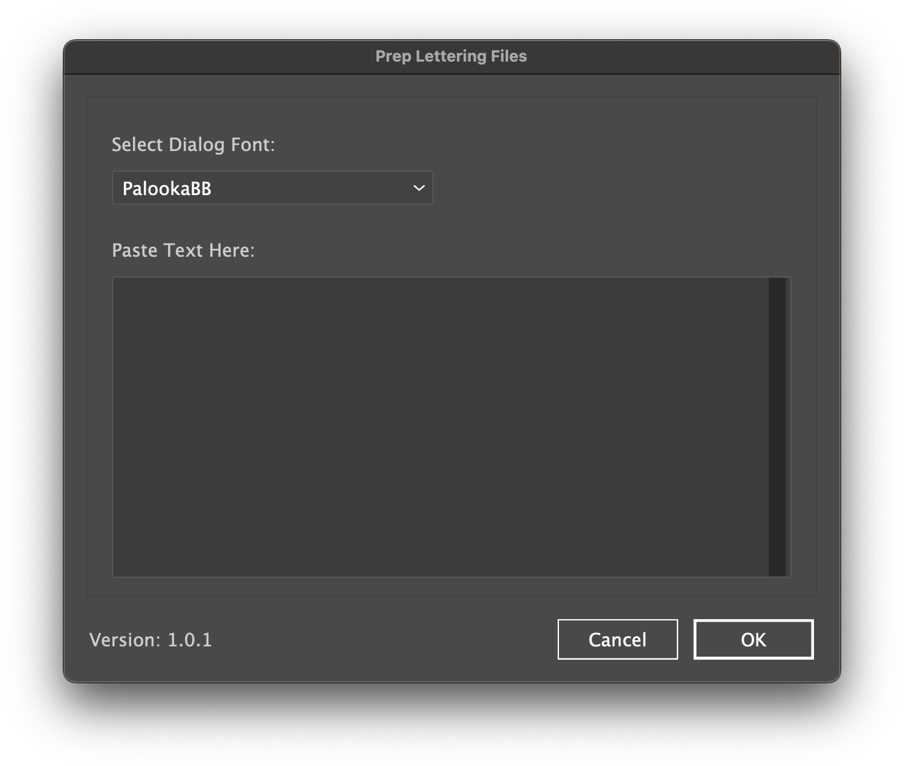

# Johnny Storm's Comic Scripts for Adobe Creative Suite
A library of Extendscripts used in the production of comics using Adobe creative suite.

## Illustrator

### ProcessText
The Process Text script takes the pasted input from a comic book script and processes the text to remove double spaces, converts quotes to smart quotes and converts en and em dashes to double dashes (--). After the script finishes processing the text it creates text objects for each paragraph.

To use paste the contents of a comic script from Microsoft Word into the interface and select the font you would like to use for the dialogue text.

The script searches your installed fonts and generates a list of fonts from <a href="https://blambot.com">Blambot</a> and <a href="https://www.comicbookfonts.com">ComicCraft</a> that you can select from to apply to the dialogue.

Dialogue is recognized two ways:
1. The script detects a tab character, in this case after the colon.
2. The script detects the pattern of number, period, text, colon then space.

#### Sample Script
Copy and paste the following text to test the script.

```
PAGE ONE - ONE PANEL

PANEL ONE
This is an example of page direction. The page direction will be included as part of the text objects created but will use the default font.

1. SPEAKER 1: This is  an "example" of —How this would– work for dialogue text.
2. SPEAKER 2: Another "example" of  dialogue —text– and how it works.
```



## Photoshop

### Merge Pages
The Merge Pages script will allow you to select two images and merge them into a single image the width of both pages.


## inDesign
Coming soon

### Links
- <a href="https://helpx.adobe.com/illustrator/using/automation-scripts.html">Learn to run and install scripts in Illustrator.</a>
- <a href="https://helpx.adobe.com/photoshop/using/scripting.html">Scripting in Photoshop</a>
- <a href="https://helpx.adobe.com/indesign/using/scripting.html">Scripting in inDesign</a>