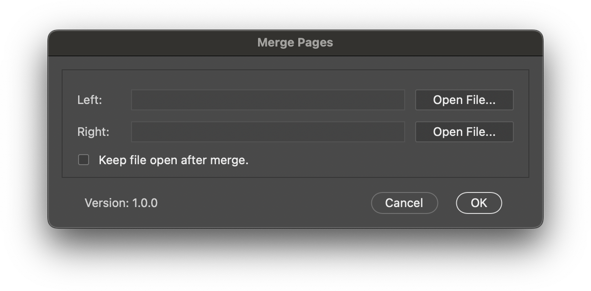

# Johnny Storm's Comic Scripts for Adobe Creative Suite
A library of Extendscripts used in the production of comics using Adobe creative suite.

## Illustrator

### LetteringFiles
This script will take a folder of TIFF files and create the corresponding lettering files. The script creates multiple layers for each aspect of the lettering file, adds a bounding box, and places the TIFF file on a template layer.

#### Illustrator Layers

| Name | Description |
| ---- | ----------- |
| Lettering | This is where your text go. |
| Top Balloons |  This is where the white part of the word balloons go. |
| Tails | This is where the tails for your baloons go. They sit between the white balloons and the outline balloons. |
| Bottom Balloons | This is where the outline balloons go. |
| Bleed | This is a guide to ensure the lettering files align perfectly in inDesign. |
| Artwork | This is a template layer (won't show up in inDesign) with the artwork placed for use in laying out your balloons. |

**PLEASE NOTE:** In order for the scrip to be dynamic it uses the height and width of the first page to determine the size of the file's artboad. Please refer to the following table to ensure your files are sized correctly.

#### Traditional American Comic Sizes:
| Single | Bleed  | Trim    | Live  |   | DPS    | Bleed  | Trim    | Live  |
| ------ | -----: | ------: | ----: | - | ------ | -----: | ------: | ----: |
| Width  | 6.875  | 6.625   | 6.125 |   | Width  | 13.5   | 13.25   | 12.75 |
| Height | 10.437 | 10.1875 | 9.687 |   | Height | 10.437 | 10.1875 | 9.687 |

<table>
    <tr>
        <td></td>
        <td></td>
    </tr>
</table>

<a href="https://bit.ly/USComicTemp"></a> **[Download Templates](https://bit.ly/USComicTemp)**

### ProcessText
The Process Text script takes the pasted input from a comic book script and processes the text to remove double spaces, converts quotes to smart quotes and converts en and em dashes to double dashes (--). After the script finishes processing the text it creates text objects for each paragraph.

To use paste the contents of a comic script from Microsoft Word into the interface and select the font you would like to use for the dialogue text.

The script searches your installed fonts and generates a list of fonts from <a href="https://blambot.com">Blambot</a> and <a href="https://www.comicbookfonts.com">ComicCraft</a> that you can select from to apply to the dialogue.

Dialogue is recognized two ways:
1. The script detects a tab character, in this case after the colon.
2. The script detects the pattern of number, period, text, colon then space.

#### Sample Script
Copy and paste the following text to test the script.

```
PAGE ONE - ONE PANEL

PANEL ONE
This is an example of page direction. The page direction will be included as part of the text objects created but will use the default font.

1. SPEAKER 1: This is  an "example" of —How this would– work for dialogue text.
2. SPEAKER 2: Another "example" of  dialogue —text– and how it works.
```


## Photoshop

### Review Copy
This script will rasterize a print-ready PDF file and export a flattened PDF (great for digital distribution), a directory of JPEG files, a directory of flattened TIFF files, or a watermarked Review Copy PDF (great for sending to review sites).


### Merge Pages
The Merge Pages script will allow you to select two images and merge them into a single image the width of both pages.



### Add Guides
The Add Guides script will add guides to your Photoshop document that represent the trim (.125in) and safe (.375in) areas.


## inDesign
Coming soon

### Links
- <a href="https://helpx.adobe.com/illustrator/using/automation-scripts.html">Learn to run and install scripts in Illustrator.</a>
- <a href="https://helpx.adobe.com/photoshop/using/scripting.html">Scripting in Photoshop</a>
- <a href="https://helpx.adobe.com/indesign/using/scripting.html">Scripting in inDesign</a>